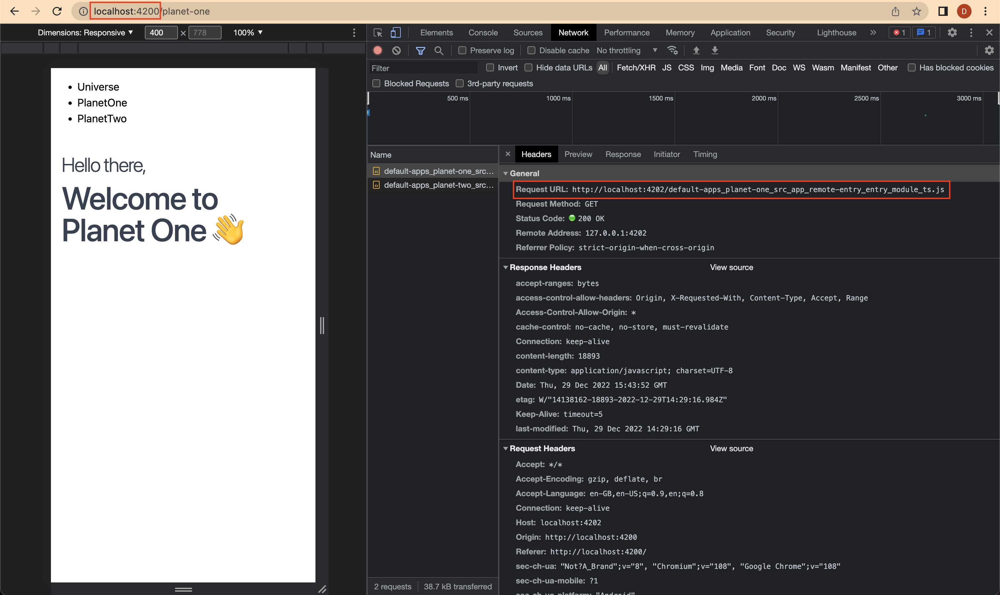
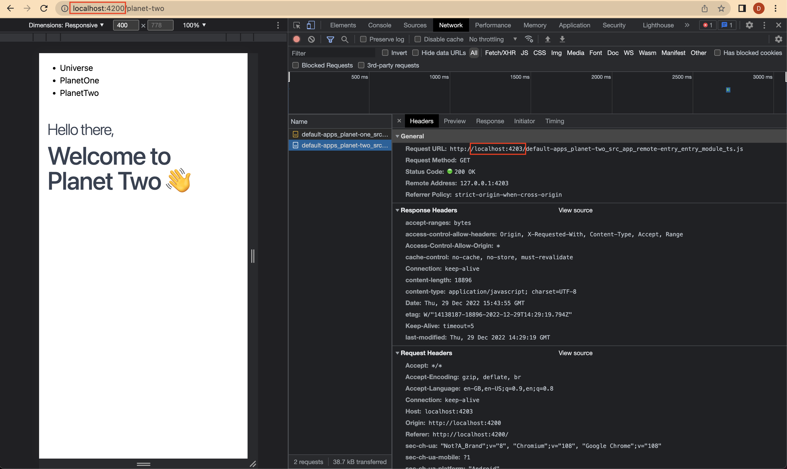

# Nx Universe

This repo is an example of how to architect an NX monorepo with micro-frontend applications.

The "Universe" app is the host application.

"Planet One" and "Planet Two" are the remote apps.

## How to get started

1. Run `npm i` in the root of the project
2. Run `ng serve universe` in the root to run the host application

Once the host (Universe) application has been launched you can navigate between the remote apps by clicking the links.

This may not look exciting but if you look at the Network tab you will see that the host application (Universe) is being served on `http://localhost:4200/`and when the "Planet One" link is clicked, the content is loaded from `http://localhost:4202/` and, Planet Two is loaded from `http://localhost:4203/`.

### Planet One

### Planet Two

